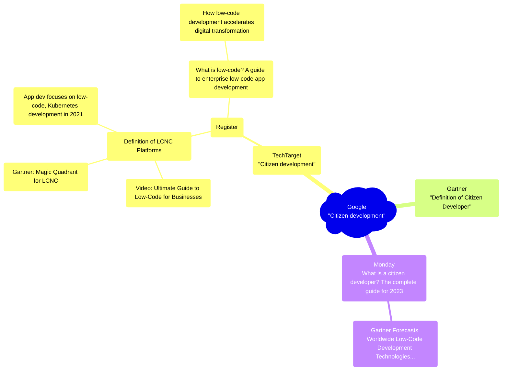

[0]: https://www.google.com/search?q=citizen+development "Search term: Citizen Development"
[1]: https://www.techtarget.com/searchsoftwarequality/definition/citizen-development "Citizen development"
[2]: https://www.gartner.com/en/information-technology/glossary/citizen-developer "Definition : Citizen Developer"
[3]: https://www.techtarget.com/searchsoftwarequality/definition/low-code-no-code-development-platform "Definition: LCNC platforms"
[4]: https://users.techtarget.com/registration/searchSoftwareQuality/Register.page "Register"
[5]: https://www.techtarget.com/searchsoftwarequality/news/252469924/Low-code-goes-mainstream-to-ease-app-dev-woes "Low-code goes mainstream to ease app dev woes"
[6]: https://www.techtarget.com/searchsoftwarequality/What-is-low-code-A-guide-to-enterprise-low-code-app-development "What is low-code? A guide to enterprise low-code app development"
[7]: https://www.youtube.com/watch?v=J7IqFWSv9rA "Ultimate Guide to Low-Code for Businesses"
[8]: https://www.gartner.com/en/documents/3991199 "Gartner Magic Quadrant for Enterprise Low-Code Application Platforms"
[9]: https://www.techtarget.com/searchsoftwarequality/feature/App-dev-focuses-on-low-code-Kubernetes-development "App dev focuses on low-code, Kubernetes development in 2021"
[10]: https://www.techtarget.com/searchsoftwarequality/tip/How-low-code-development-accelerates-digital-transformation "How low-code development accelerates digital transformation"
[11]: https://monday.com/blog/app-developers/citizen-developer/ "What is a citizen developer? The complete guide for 2023"
[12]: https://www.gartner.com/en/newsroom/press-releases/2021-02-15-gartner-forecasts-worldwide-low-code-development-technologies-market-to-grow-23-percent-in-2021 "Gartner Forecasts Worldwide Low-Code Development Technologies Market to Grow 23% in 2021"

# [Google][0]
I searched for "Citizen development" but ignore sponsored content. The excerpt that Google chose for this entry is not wikipedia but Techtarget. it reads: 

> _“Citizen development is a business process that encourages non-IT-trained employees to become software developers, using IT-sanctioned low-code/no-code (LCNC) platforms to create business applications.”_

I found two links worth pursuing first one on [TechTarget][1] and another on [Gartner][2]

## [TechTarget: "Citizen Development"][1]

This is an educational article. Written by Jerry Liptak (Freelance) & Lauren Horwitz from (Cisco). It's part of an article series [_"What is low-code? A guide to enterprise low-code app development"_][6]. So apparently “Citizen Development” and “low-code” are related terms.

The article introduces the term low-code/no-code (LCNC) platforms and points to a definition off [LCNC platforms][3] But apparently TechTarget is a first-fix-is-free kinda website. The reminder of the links on TechTarget are concealed behind a login wall - I [register][4] it's free.

The focus is on the benefit employees gets from being able to help them selves with IT issues, without having to engage the IT department. The approach 

> _"speeds innovation and the application development process"_ 

and it 

> _"addresses security problems associated with shadow IT and third-party apps through transparency"_". 

The article claims that 

> _"Businesses that devote time and resources to the citizen development community have seen an uptick in efficiency and productivity."_ 

but the source to that information is not given. It presents an infographic about pros and cons:

### [LCNC Platforms][3]
Written by [Mary K. Pratt](https://www.techtarget.com/contributor/Mary-K-Pratt)

A bolt statement says that:

> _"The growth of low-code/no-code platforms has proliferated due to a [lack of skilled software developers][5]"_ 

and explains LCNC as: 

> _"Users can create applications as if they were drafting a flowchart rather than writing line-by-line codes for each desired function and capability. These platforms also generally have features that allow for experimenting, prototyping, testing and deployment."_

It links to video on YouTube [Ultimate Guide to Low-Code for Businesses][7] - it's eleven minutes

Historically it describes LCNC as related to Rapid Application Development (RAD) - a topic which could be another rabbit hole research worthy (but I won't go into that hole now.)

It also includes a quite comprehensive list of both low-code and no-code tools and throws a reference to ["2020 Magic Quadrant for Enterprise Low-Code Application Platforms"][8]

The article throws a forecast for the future:

> _"Analysts at Gartner estimate that the low-code market grew 23% in 2020 to reach $11.3 billion, and will grow to $13.8 billion in 2021 and almost $30 billion by 2025. Gartner also forecasts that low-code application development will account for 65% of all application development activity by 2024, mostly for small and medium-sized projects. Meanwhile, Forrester projects about half of firms today use a low-code platform, but this number [could rise to 75%](https://www.techtarget.com/searchsoftwarequality/feature/App-dev-focuses-on-low-code-Kubernetes-development) by the end of 2021."_

### [What is low-code? A guide to enterprise low-code app development][6]

The article is written [Stephen J. Bigelow,](https://www.techtarget.com/contributor/Stephen-J-Bigelow) it has a link to the [exact same video][7] which perhaps indicates that the content on TechTarget probably isn't that well coordinated. This article also lists the same comprehensive list of tools, at the previous. and It reuses infographics from [_App dev focuses on low-code, Kubernetes development in 2021_][9]

Most interesting here is the section on low-code development principles.

* Understand the low-code platform
* Avoid customization
* Generalize customization
* Don't overlook the team
* Keep business in the lead

It ties low-code to [digital transformation strategies][10]

### [App dev focuses on low-code, Kubernetes development in 2021][9]
Written by Darryl K. Taft

Shows som interesting numbers (in reference to Gartner)
  

## [Gartner][2]
This is literally just a definition not muct else to go at:

> _"A citizen developer is an employee who creates application capabilities for consumption by themselves or others, using tools that are not actively forbidden by IT or business units. A citizen developer is a persona, not a title or targeted role. They report to a business unit or function other than IT. &nbsp;&nbsp;All citizen developers are business technologists.  However, all business technologists are not necessarily citizen developers.  There is no required designation of proficiency or time allocation for citizen developers but they must be legal employees of an organization."_

## [What is a citizen developer? The complete guide for 2023][11]
Although this essentially is a sales pitch to start using Monday it's a good read...

It presents 4 principles, key to citizen development:

...and a success model:

and it references Marc Andreessens icon article from 2011: _"Why software is eating the world"_

### [Gartner Forecasts Worldwide Low-Code Development Technologies Market to Grow 23% in 2021][12]
The worldwide low-code development technologies market is projected to total $13.8 billion in 2021, an increase of 22.6% from 2020

